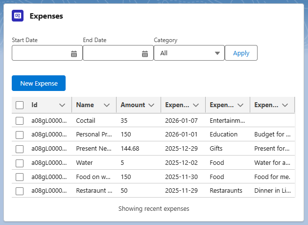
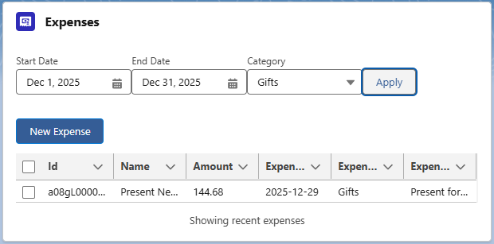
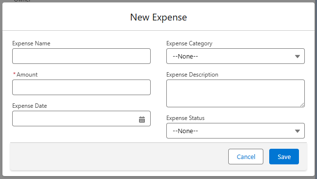

# Expense Manager (Salesforce)

A Salesforce application for managing personal expenses, built with Apex and Lightning Web Components (LWC).

## Overview

Expense Manager is a custom Salesforce application that allows users to:

- View recent expenses in a sortable table
- Filter expenses by date range and category
- Create new expense records using a modal form
- See real-time updates after creating new records

## Technical Architecture

The application follows a client-server architecture using Salesforce best practices:

- **Lightning Web Components (LWC)** are responsible for the user interface, user interactions, and state management.
- **Apex classes** handle data retrieval and filtering logic.
- Communication between LWC and Apex is done via `@AuraEnabled` methods.
- Data is queried using SOQL with optional dynamic filtering.

## Backend Logic (Apex)

The backend logic is implemented in the `ExpenseService` Apex class and includes:

- Retrieving the most recent expense records
- Filtering expenses by optional parameters:
  - Start Date
  - End Date
  - Category
- Returning optimized query results with a record limit to ensure performance

## Frontend Logic (Lightning Web Components)

The frontend is built using Lightning Web Components and includes:

- A main component displaying expenses in a `lightning-datatable`
- Filter controls for dynamic data retrieval
- A modal component for creating new expense records
- Custom events for parent-child communication between components
- Toast notifications for successful record creation

## What This Project Demonstrates

This project demonstrates the following Salesforce development skills:

- Designing Apex service classes with clear responsibilities
- Building reusable Lightning Web Components
- Implementing parent-child communication using custom events
- Working with `@wire` and imperative Apex calls
- Applying client-side filtering logic combined with server-side SOQL
- Handling UI state (loading, empty states, errors)
- Using Salesforce Lightning Design System (SLDS) for consistent UI styling

## Data Model

The application is based on a custom Salesforce object:

- **Expense__c**
  - Name
  - Amount__c
  - ExpenseDate__c
  - ExpenseCategory__c
  - ExpenseDescription__c
  - ExpenseStatus__c
 
## Screenshots

### Expense List

### Filtering Expenses

### Create New Expense

## Future Improvements

Possible future enhancements include:

- Pagination for large datasets
- Advanced filtering options
- Edit and delete expense functionality
- Unit tests for Apex classes
- Improved error handling and loading indicators

## Challenges & Lessons Learned

During development, several challenges were encountered and resolved, including:

- Designing flexible Apex methods to support multiple optional filter parameters
- Managing UI state between parent and child Lightning Web Components
- Implementing modal dialogs using SLDS while maintaining Salesforce UX standards
- Handling asynchronous data refresh after record creation
- Structuring code for readability and long-term maintainability

These challenges helped reinforce best practices in Salesforce development and improved overall understanding of LWC architecture.

## Learning Resources

The following resources were used during development:

- Salesforce official documentation (Apex, LWC, SLDS)
- Trailhead modules related to Lightning Web Components and Apex
- Online Salesforce development courses
- Hands-on experimentation within a Salesforce Developer Org

